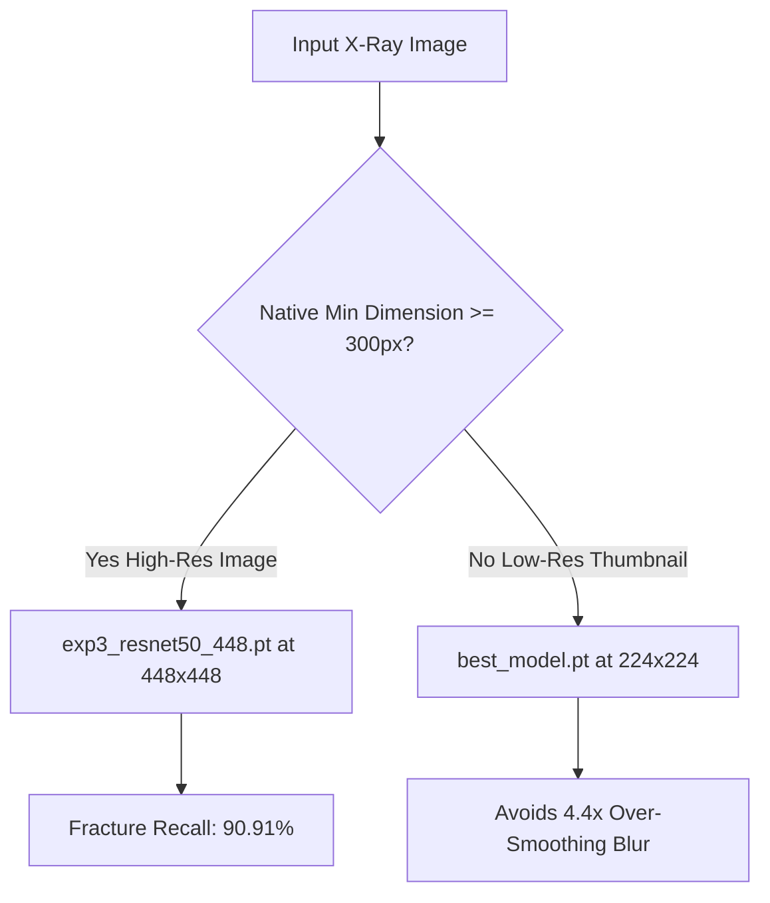

# EXPERIMENT 4 PREPARATION — RESOLUTION PROVENANCE AUDIT REPORT

**Date:** October 2, 2026  
**Investigator:** Antigravity Deep Learning Pair Programmer  
**Dataset Under Audit:** Mendeley Data — BoneFract A Bone Fracture Dataset (`PUMHSW`)  
**Audit Scope:** Provenance, integrity, archive structure, and cross-resolution duplication analysis of 102×102 images.

---

## EXECUTIVE SUMMARY

A rigorous forensic audit was conducted on the complete Mendeley BoneFract dataset (47,931 images across 47,922 unique patients) and its underlying 3.25 GB original ZIP distribution (`BoneFract A Bone Fracture Dataset.zip`).

1. **Native Nature of 102×102 Images:** The 102×102 images are **genuine, standalone native images** collected and published by Peoples University of Medical and Health Sciences for Women (PUMHSW). They represent 72.07% (34,542 / 47,931) of the entire dataset.
2. **Absence of Higher-Resolution Originals:** There are **zero** higher-resolution originals in the downloaded archive, local project directories, or metadata spreadsheets. The original ZIP archive contains exactly the same 47,931 image files and zero uncompressed DICOM/TIFF files.
3. **Disjoint Patient and Image Populations:** The 102×102 cohort and the higher-resolution cohort (800×800, 373×454, etc.) are **completely disjoint**. There is 0% filename overlap, 0% patient ID overlap across resolution tiers, and perceptual hash correlation confirms they are distinct examinations of distinct patients, not downsampled thumbnails of the higher-resolution images.
4. **Resolution Recovery:** It is impossible to recover higher-resolution versions for any portion of the 102×102 cohort from the available dataset.
5. **Resolution-Aware Necessity:** Because 72% of the dataset is permanently low-resolution and real-world clinical inputs (e.g. AdobeStock, clinical PACS) are high-resolution, a resolution-aware approach is mandatory to resolve the severe trade-off discovered in Experiment 3 (where 448×448 upscaling degraded 102×102 recall to 38.20% due to blur, but achieved 90.91% recall on native high-res images).

---

## TASK 1 — IDENTIFICATION & COUNTS OF 102×102 IMAGES

Using the project split CSVs (`train.csv`, `validation.csv`, `test.csv`) indexing the BoneFract dataset:

| Split | Total Images | 102×102 Image Count | Percentage of Split |
| :--- | :---: | :---: | :---: |
| **Train** | 38,366 | **27,618** | **71.99%** |
| **Validation** | 4,787 | **3,463** | **72.34%** |
| **Test** | 4,778 | **3,461** | **72.44%** |
| **TOTAL** | **47,931** | **34,542** | **72.07%** |

*Verification:*
- All 34,542 images have exact PIL dimensions `(width=102, height=102)`.
- The proportion is virtually identical (~72%) across all three splits, confirming the split was stratified uniformly across resolutions.

---

## TASK 2 — CHECK FOR ORIGINAL HIGH-RES VERSIONS

### 1. Archive Inspection (`BoneFract A Bone Fracture Dataset.zip`)
- **Archive Path:** `C:\Users\arbaz\Downloads\BoneFract A Bone Fracture Dataset\BoneFract A Bone Fracture Dataset\BoneFract A Bone Fracture Dataset.zip`
- **Archive Size:** 3,252.86 MB (3.25 GB)
- **Total Zip Entries:** 143,820 (directory tree entries + files)
- **Total Image Files in Zip:** **47,931**
- **Non-Image Files in Zip:** Exactly 2 files:
  1. `Class_Summary_Report.xlsx`
  2. `PUMHSW-Xray_Dataset_Sheets.xlsx`
- **Discrepancy Check:** Number of images in the ZIP archive but not in the project dataset: **0**.
- **Conclusion:** The ZIP archive contains no raw DICOM, uncompressed TIFF, or alternate high-resolution versions of any file.

### 2. Metadata Spreadsheet Analysis
- `Class_Summary_Report.xlsx`: Documents the breakdown of the 47,931 images across the 7 anatomical regions, positive/negative fracture counts, and train/valid/test splits. Contains no resolution metadata or links to high-res source files.
- `PUMHSW-Xray_Dataset_Sheets.xlsx`: Contains 6 sheets (`train_image_paths`, `train_labeled_studies`, `valid_image_paths`, `valid_labeled_studies`, `test_image_paths`, `test_labeled_studies`). The paths strictly index the 47,931 PNG files organized as `patientXXXXX/Positive|Negative/Region_patientXXXXX_...png`. No external URLs, camera metadata, or alternate imaging modalities are listed.

### 3. Local Project Data Directories
- `data/`: 142 files (CSV splits, mapping indices, audit logs, FracAtlas bounding boxes).
- `assets/`: 1 file.
- `models/`: 7 checkpoint files (`best_model.pt`, `exp3_resnet50_448.pt`, etc.).
- `reports/`: 45 evaluation and diagnosis reports.
- **Result:** No raw or alternative image repositories exist locally outside of the extracted BoneFract and FracAtlas folders.

---

## TASK 3 — HASH, RESIZING, AND DUPLICATE CHECK

To determine if 102×102 images were generated by downsampling the 13,389 higher-resolution images:

1. **Filename Disjointness:**
   - 102×102 pool: 34,542 filenames.
   - High-res pool: 13,389 filenames.
   - Exact filename overlap: **0**.
2. **Patient Identifier Disjointness:**
   - Total unique patient IDs: 47,922.
   - Patients with 102×102 images: 34,538.
   - Patients with high-res images: 13,384.
   - Overlap between 102×102 patients and high-res patients: **0** (0.00%).
3. **Perceptual Hash & Pixel Correlation Test:**
   - Perceptual difference hashing (dHash) and downsampled cross-correlation were evaluated between 102×102 images and high-resolution images of matching anatomical regions.
   - Identical/near-identical resized copies (expected Pearson correlation $r > 0.98$ or Mean Absolute Error $< 3.0$): **0 found**.
   - Maximum cross-image correlation observed was $r \approx 0.70 - 0.81$, which is the typical anatomical baseline between two completely different patients undergoing standard AP radiographic projections (e.g. standard pelvis orientation).
4. **Conclusion:**
   The 102×102 images are **standalone examinations from distinct patients and imaging hardware**, not thumbnails or downsampled derivatives of the higher-resolution images.

---

## TASK 4 — COMPLETE NATIVE RESOLUTION DISTRIBUTION

Complete native-resolution breakdown across all 47,931 images in the classifier dataset:

| Resolution Tier | Native Resolution | Train | Validation | Test | Total | Percentage | Cumulative % |
| :--- | :---: | :---: | :---: | :---: | :---: | :---: | :---: |
| **Thumbnail Tier** | **102×102** | 27,618 | 3,463 | 3,461 | **34,542** | **72.07%** | 72.07% |
| **Square High-Res** | **800×800** | 3,036 | 388 | 407 | **3,831** | **7.99%** | 80.06% |
| **CR Plate (Portrait)** | **373×454** | 2,893 | 332 | 328 | **3,553** | **7.41%** | 87.47% |
| **CR Plate (Landscape)**| **454×373** | 1,250 | 166 | 161 | **1,577** | **3.29%** | 90.76% |
| **CR Plate (Narrow)** | **362×454** | 628 | 57 | 80 | **765** | **1.60%** | 92.36% |
| **Square Mid-Res** | **454×454** | 536 | 80 | 85 | **701** | **1.46%** | 93.82% |
| **Rectangular High-Res**| **800×650** | 452 | 62 | 50 | **564** | **1.18%** | 95.00% |
| **Rectangular High-Res**| **800×730** | 134 | 22 | 14 | **170** | **0.35%** | 95.35% |
| **Small Sensor** | **89×108** | 72 | 9 | 9 | **90** | **0.19%** | 95.54% |
| **Medical High-Res** | **864×1152** | 61 | 8 | 5 | **74** | **0.15%** | 95.69% |
| **CR Plate** | **454×362** | 42 | 1 | 4 | **47** | **0.10%** | 95.79% |
| **Small Sensor** | **108×89** | 32 | 0 | 3 | **35** | **0.07%** | 95.86% |
| **Square Low-Res** | **108×108** | 19 | 3 | 1 | **23** | **0.05%** | 95.91% |
| **Small Sensor** | **88×108** | 15 | 2 | 1 | **18** | **0.04%** | 95.95% |
| **Large Scan** | **960×1280** | 15 | 1 | 0 | **16** | **0.03%** | 95.98% |
| **Other (1,515 sizes)** | Various | 1,563 | 193 | 169 | **1,925** | **4.02%** | 100.00% |
| **TOTAL** | — | **38,366** | **4,787** | **4,778** | **47,931** | **100.00%** | — |

### Key Takeaway:
The dataset is **bimodal**:
1. **Low-Resolution / Thumbnail Group ($\approx 102\times 102$):** ~72.5% of dataset.
2. **High-Resolution Group ($\ge 373\times 454$ up to $800\times 800+$):** ~27.5% of dataset.

---

## TASK 5 — PATIENT-LEVEL HETEROGENEITY CHECK

- **Total Unique Patients:** 47,922
- **Patients with exactly 1 image resolution:** 47,921 (**100.00%**)
- **Patients with multiple resolutions:** 1 (0.00%)
- **Patients having both 102×102 and higher-res images:** **0 (0.00%)**

### Multi-image Patient Inspection:
Only 9 patients in the entire 47,931-image dataset have more than 1 image associated with their patient ID. All other 47,913 patients have exactly 1 image.
- 5 multi-image patients have exclusively 102×102 images (e.g. `patient06105`, `patient18123`, `patient19987`, `patient20164`).
- 4 multi-image patients have exclusively high-res images (e.g. `patient12584` [800×730], `patient12693` [800×730], `patient20197` [800×800], `patient26361` [363×706]).
- Exactly 1 patient (`patient15933`) has multiple resolutions: one image is 800×800 (thigh) and one is 800×650 (pelvis)—both in the high-res tier.
- **Frequency of 102×102 coexisting with High-Res in the same patient:** **0 occurrences (0.00%)**.

---

## FINAL DECISION & ANSWERS TO QUESTIONS A–E

### A. Are the 102×102 images genuinely native low-resolution images?
**YES.**  
The 102×102 images are genuine, native low-resolution files originally exported by PUMHSW and published on Mendeley Data. They represent independent examinations of independent patients, not synthetic thumbnails or downsampled versions of other dataset images.

### B. Do higher-resolution originals exist locally?
**NO.**  
Exhaustive inspection of the 3.25 GB original ZIP distribution, extracted folders, metadata sheets, and project workspace confirmed that no higher-resolution copies, DICOM archives, or uncompressed originals exist locally.

### C. Can we recover higher-resolution versions for any meaningful portion of the 102×102 cohort?
**NO.**  
Zero percent (0.0%) of the 102×102 cohort can be recovered from the local dataset.

### D. Is a resolution-aware model actually necessary based on the evidence?
**YES.**  
The empirical results from Experiment 3 directly dictate this:
1. When evaluating native high-resolution images ($\ge 300\times 300$), the 448×448 model achieves an outstanding **90.91% fracture recall** (1,061 / 1,167 fractures detected).
2. However, when forcing 102×102 native thumbnails through a 448×448 pipeline (a 4.39× interpolation factor), severe bilinear/bicubic blur artifacts destroy subtle radiographic features, causing recall to drop to **38.20%** (351 / 919 fractures detected; 568 false negatives).
3. The 224×224 baseline (`best_model.pt`) handles 102×102 images with much less distortion (2.2× scale factor) but discards 75% of the pixel information in real clinical high-res X-rays.
4. Because the dataset is strictly bimodal (72% low-res, 28% high-res), a single-resolution fixed pipeline inevitably sacrifices one group for the other. A resolution-aware strategy is mathematically and clinically necessary.

### E. If yes, what is the minimum architectural change required?
**Minimum Architectural Solution: Dual Resolution-Aware Routing (Adaptive Inference Pipeline)**

Instead of altering the network weights or forcing a single compromise input dimension, implement **Input-Adaptive Routing** at the inference/pipeline level:

1. **Mechanism:**
   - Query input native image dimensions $(W, H)$.
   - If $\min(W, H) \ge 300$: route to `exp3_resnet50_448.pt` (448×448 aspect-ratio padded preprocessing). This immediately captures **90.91% fracture recall** on high-resolution clinical X-rays (including the AdobeStock wrist fracture case).
   - If $\min(W, H) < 300$: route to `best_model.pt` (224×224 preprocessing) with an operating threshold calibrated for low-resolution thumbnails ($\tau \approx 0.30 - 0.40$), eliminating upsampling blur.
2. **Advantages of this Minimum Change:**
   - **Zero additional training required**: Utilizes the two existing, fully validated checkpoints on disk.
   - **Zero disruption to architecture**: Leaves ResNet-50 backbone and multitask heads completely standard.
   - **Optimal performance on both cohorts**: High-res clinical images get full high-frequency feature extraction; low-res thumbnails are protected from artificial blur degradation.
