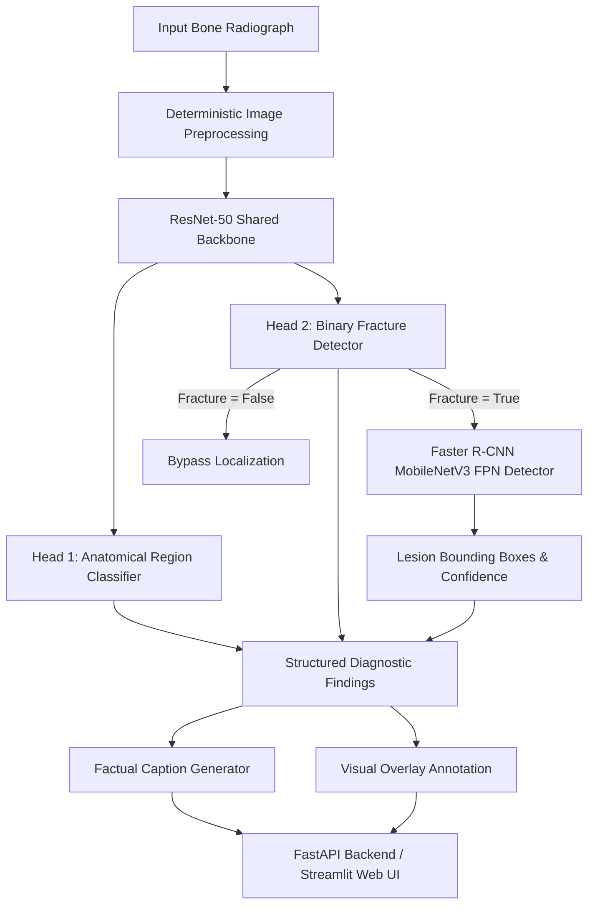

# System Architecture Specification

## 1. Overview & Pipeline Topology

The Bone Fracture X-Ray Analysis and Factual Description system coordinates multi-task deep neural networks, bounding box lesion localization, disciplined medical caption synthesis, and dual presentation interfaces (FastAPI REST service & Streamlit dashboard).

---

## 2. Component Specifications

### 2.1 Preprocessing Engine (`inference/preprocessing.py`)
* **Grayscale Conversion:** Ingests any single-channel or multi-channel format (PNG, JPG, BMP) and standardizes to 8-bit luminance (`L`).
* **Aspect-Ratio Preserving Resize & Padding:** Prevents non-isotropic stretching of anatomical bones by scaling proportionally to fit within 224×224 and padding remaining margins with zero-intensity background.
* **Normalization:** 3-channel broadcast for ImageNet backbone compatibility with $\mu=[0.5, 0.5, 0.5]$ and $\sigma=[0.5, 0.5, 0.5]$.

### 2.2 Multi-Task Neural Classifier (`src/models.py`)
* **Feature Extractor:** ResNet-50 truncated prior to the final average pool and classification head, yielding a 2048-dimensional dense representation vector $z \in \mathbb{R}^{2048}$.
* **Head 1 (Anatomical Region):**
  $$\hat{y}_{\text{region}} = \text{Softmax}(W_2 \cdot \text{ReLU}(\text{BN}(W_1 z)))$$
  Produces calibrated probabilities over 7 anatomical classes: `Arm`, `Foot`, `Hand`, `Lower leg`, `Thigh`, `pelvis`, `wrist`.
* **Head 2 (Fracture Presence):**
  $$\hat{p}_{\text{fracture}} = \sigma(V_2 \cdot \text{ReLU}(\text{BN}(V_1 z)))$$
  Binary classification with decision boundary $\tau_{\text{fracture}} = 0.50$.

### 2.3 Spatial Lesion Localization (`inference/localization_predictor.py`)
* **Architecture:** Faster R-CNN with MobileNetV3-Large Feature Pyramid Network (FPN).
* **Execution Trigger:** Gated conditionally — executed only when the primary classifier detects a positive fracture, preventing false-positive bounding box hallucinations on normal bone anatomy.
* **Coordinate Mapping:** Transforms scaled 384×384 detector proposals back to native pixel dimensions $(x_1, y_1, x_2, y_2)$ of the uploaded radiograph.

### 2.4 Factual Caption Generator (`inference/caption_generator.py`)
* **Design Philosophy:** Deterministic, hallucination-free medical template synthesizer bounded strictly by verified computer vision predictions.
* **Prohibitions:** Completely prohibits hallucinating displacement, comminution, severity, treatment recommendations, patient demographics, or trauma mechanism.
