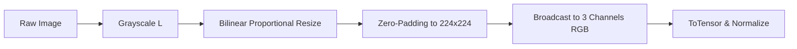

# Data Pipeline & Partitioning Methodology

## 1. Data Ingestion & Quality Auditing

The data pipeline processes bone radiographs from two complementary sources:
1. **BoneFract (Mendeley Data):** Multi-class whole bone radiographs across 7 anatomical regions.
2. **FracAtlas (Nature Scientific Data):** High-resolution radiographs with bounding box annotations for fracture localization.

### Automated Integrity Checks:
* File header verification using PIL to detect truncated or corrupted payloads.
* MD5 hash computation for every image to identify exact duplicates.
* Aspect ratio and dimensional distribution profiling.

---

## 2. Leak-Free Patient-Cluster Partitioning

A critical flaw in standard random splitting of medical datasets is **patient leakage** and **near-duplicate image leakage**, where different radiographic projections or identical images of the same patient appear in both training and test sets, artificially inflating validation performance.

### Cluster Algorithm:
1. Extract patient identifiers and MD5 image hashes.
2. Construct bipartite graph $G = (V_{\text{patients}}, V_{\text{hashes}}, E)$.
3. Compute connected components (patient clusters) such that any two patients sharing an identical image hash belong to the same cluster.
4. Perform stratified partitioning across the clusters based on dominant anatomical region and fracture prevalence:
   * **Training Partition:** 80%
   * **Validation Partition:** 10%
   * **Untouched Test Partition:** 10%

```
Check 1 (Patient Overlap): Train/Val=0, Train/Test=0, Val/Test=0  -> PASSED
Check 2 (Image Hash Overlap): Train/Val=0, Train/Test=0, Val/Test=0 -> PASSED
```

---

## 3. Standardization & Transformation Pipeline



* **Training Augmentation:** Conservative medical transforms only:
  * Subtle rotation ($\pm 10^\circ$)
  * Minor translation ($\pm 5\%$) and scale ($\pm 5\%$)
  * Mild color jitter (brightness $\pm 10\%$, contrast $\pm 10\%$)
  * Horizontal flip only where anatomically bilateral
* **Validation & Test Transforms:** Strictly deterministic resize, padding, and normalization.
